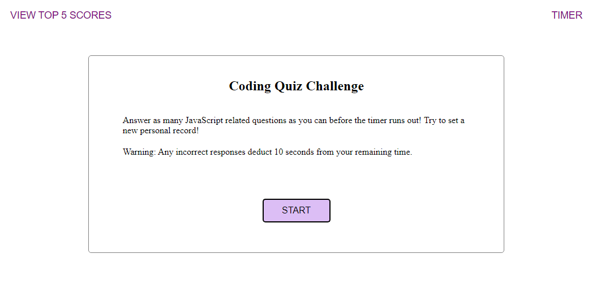

# 4-weekly-challenge
Coding Quiz
Week 4 Challenge - Creating a timed test

## Description

This repository contains the files for a timed test on JavaScript topics. Using Javascript, a click starts the timer and begins the question object. The answer choices are displayed as clickable buttons using a for loop. The responses are then checked against the string of the correct answer, with correct/incorrect text displayed after the user makes a selection. The final score is then shown with a prompt to enter the users initials. The top scores are logged to localStorage as an array which can then be recalled by clicking the View Top 5 Highscores.

## Usage

https://joaqsala.github.io/4-weekly-challenge/

This webpage contains a timed quiz of Javascript questions. The user has 45 seconds to answer as many questions as they can. Each answer is checked immediately with incorrect answers leading to a 10-second penalty. After the timer runs out, the number of correct answers is displayed as the users score. The top 5 scores, along with the users initials, are saved.

## Credits

To my University of Texas Bootcamp Cohort that helps, pushes, and encourages me on.

These and more JavaScript questions can be found at 
https://www.sanfoundry.com/1000-javascript-questions-answers/

## License

Please refer to LICENSE in repo.
